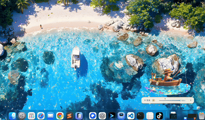
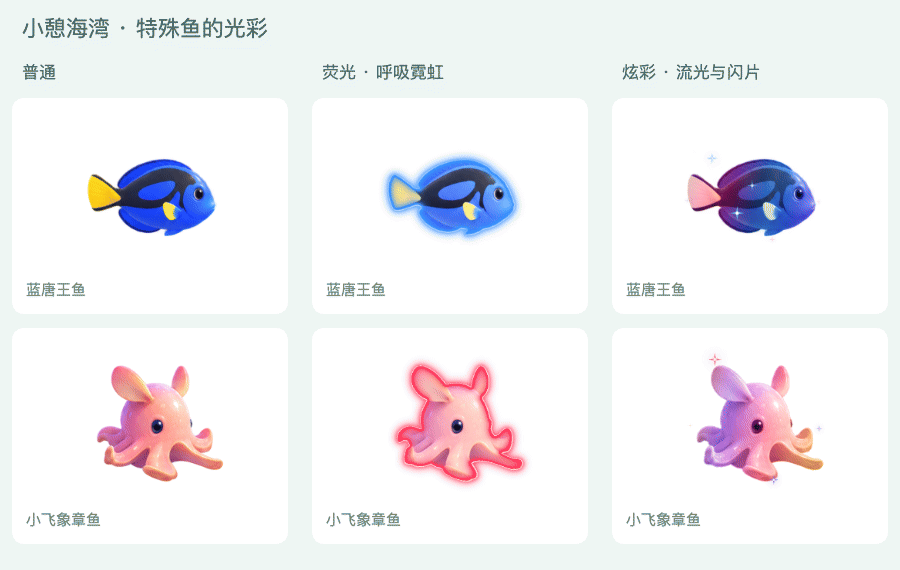
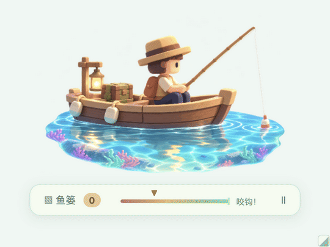

<div align="center">

# Thank You for the Fish 🐟

**Your work is done. Your shift isn't. Go fishing.**

**上班没啥事儿，又不能立马走，怎么办？就摸鱼！**

A tiny boat, a hundred sea creatures, and a little joy between tasks.  
A cozy idle fishing companion for your Mac desktop.

**小憩海湾 · Thank You for the Fish**

**English** · [简体中文](README.zh-CN.md)

[](https://github.com/AmethystineAlpaca/thank-you-for-the-fish/releases/latest)

[](https://github.com/AmethystineAlpaca/thank-you-for-the-fish/actions/workflows/test.yml)
[](LICENSE)

</div>

**Free & open source · Apple Silicon Mac · No account · Works offline after setup**

> The current app interface is in **Simplified Chinese**.  
> English button references are included in the [Download & play](#download--play) section below.

<p align="center">
  
</p>

<p align="center">
  <i>A little boat in the corner of your desktop, quietly waiting for the next bite.</i>
</p>

You've answered the messages. Finished the task. Checked the clock.

Somehow, only three minutes have passed.

Then the float dips.

The rod bends.

A fish jumps out of the water.

**Today's accomplishments: one finished task, one suspiciously colorful fish.**

Thank You for the Fish puts a miniature fishing boat on your Mac desktop. Leave it there while you work, study, pretend to work, or wait for five o'clock. Every now and then, something bites.

Catch fish. Fill your field guide. Find strange color variants. Then go back to whatever you were definitely doing.

No frantic clicking.  
No daily quests.  
No account.  
No guilt if you ignore it for three hours.

Just a tiny ocean living beside your spreadsheets.

<p align="center">
  
</p>

**[Download & play](#download--play)** ·
**[Meet the fish](#100-sea-creatures-400-ways-to-get-distracted)** ·
**[Run from source](#run-from-source)** ·
**[Contribute](CONTRIBUTING.md)**

---

## A little sea beside your spreadsheets

A wooden boat bobs on turquoise water. Reflections ripple. The fishing line sways. Your tiny angler waits.

You don't need to do anything.

When a fish bites, the float dips, the rod lifts, and your catch jumps from the water with a splash. Its name and weight appear, and it goes straight into your collection — even if you weren't looking.

Drag the boat anywhere on your desktop. Resize it from **60% to 150%**, keep it above other windows if you want, or let it quietly sit behind them.

The app remembers where you left it.

A small activity indicator gradually shifts from warm red toward soft green, giving you a vague sense that *something might happen soon* without turning fishing into another productivity timer.

<p align="center">
  
</p>

**You're waiting for five o'clock. They're waiting for a bite.**

---

## 100 sea creatures. 400 ways to get distracted.

There are **100 fish and other marine creatures** to discover across five field-guide groups, from colorful reef neighbors to strange deep-sea visitors.

Undiscovered creatures stay hidden behind silhouettes and question marks.

Catch one, and it joins your field guide with its name, artwork, description, size, weight, and collection value.

Then things get slightly more dangerous for your productivity.

Every species can appear in **four different traits**, giving you:

**100 species × 4 traits = 400 possible collection variants.**

| Trait | What makes it special |
| --- | --- |
| **Normal** | The creature's natural appearance. Simple, familiar, and surprisingly easy to get attached to. |
| **Alternate** | A different palette built around the creature's original colors. Familiar, but clearly not the one you caught last time. |
| **Glow** | Luminous color, bright outlines, and softly breathing neon effects while the original details remain visible. |
| **Prismatic** | Flowing color bands, pearly highlights, animated gradients, and sparkles. The unnecessarily fancy one. |

Special palettes are generated around each creature's visual identity rather than applying the same tint to everything.

Cool-toned creatures might shift through icy blue, lilac, and rose. Warm-toned creatures lean toward apricot, coral, gold, and lavender.

Open a catch's detail view and the creature comes alive: tails wag, fins flutter, tentacles sway, and special effects move across the body.

You opened the basket to check one fish.

Twenty minutes later, you are comparing three differently colored octopuses.

This is normal.

---

## Keep the fish. Collect the little wins.

Your basket remembers everything you've caught.

Search by name, filter by trait, or sort by newest catch, value, or weight.

A few useful things:

- **Choose your own pace**  
  Set a random bite interval anywhere from **1 to 120 minutes**, or pause fishing completely.

- **Try before you wait**  
  Use **试钓一下** to preview a catch without changing your real collection or fishing timer.

- **Everything stays local**  
  Your collection, settings, artwork, and saves live on your Mac.

- **No account required**  
  There is nothing to sign into.

- **No shop, trading, or monetization system**  
  Collection value is just that: collection value.

- **No offline fish factory**  
  Closing the app preserves your collection, but fish do not accumulate indefinitely while the app is closed.

Your collection saves automatically.

When the Mac wakes from sleep, the app may resolve at most one waiting catch instead of flooding your basket with everything that theoretically happened overnight.

> Creature designs, sizes, rarity, weights, and values are stylized game representations rather than scientific data.

---

## Download & play

### Apple Silicon Macs

This release is built for Macs with **Apple Silicon**:

- M1
- M2
- M3
- M4
- and later Apple Silicon chips

### Installation

1. Open the [latest release](https://github.com/AmethystineAlpaca/thank-you-for-the-fish/releases/latest).

2. Download:

   `thank-you-for-the-fish-macos-arm64.zip`

3. Unzip it.

4. Drag **Thank You for the Fish.app** into **Applications**.

5. Open it.

A little boat should appear on your desktop, and **Thank You for the Fish** will appear in the macOS menu bar.

You're fishing.

### macOS says the app cannot be opened?

The current build is **not Developer ID signed or notarized**.

If macOS blocks the first launch, make sure you downloaded the app from this repository's official release page, then follow Apple's instructions for opening an app from an unidentified developer:

[Open a Mac app from an unidentified developer](https://support.apple.com/guide/mac-help/open-a-mac-app-from-an-unknown-developer-mh40616/mac)

### Current Chinese interface guide

| What you want to do | Where to click |
| --- | --- |
| Open your basket | **鱼篓** below the boat, or **Thank You for the Fish → 打开鱼篓** |
| Browse the field guide | **海洋图鉴** in the basket sidebar |
| Change fishing settings | **垂钓设置**, or **Thank You for the Fish → 打开设置…** |
| Pause / resume | **Ⅱ / ▶** below the boat |
| Resize the boat | Drag **◢** in the lower-right corner; double-click to reset |
| Find a hidden boat | **Thank You for the Fish → 显示小船** |
| Quit | **退出 Thank You for the Fish** |

---

## Run from source

Requires:

- **macOS**
- **Node.js 22.12.0 or newer**
- **npm**

Clone the repository:

```sh
git clone https://github.com/AmethystineAlpaca/thank-you-for-the-fish.git
cd thank-you-for-the-fish
npm ci
npm start
```

The first install downloads the required dependencies and Electron.

Later launches only need:

```sh
npm start
```

If Electron reports an incomplete installation:

```sh
node node_modules/electron/install.js
npm start
```

### Build the Apple Silicon app

```sh
npm run package
```

Output:

```text
dist/Thank You for the Fish-darwin-arm64/Thank You for the Fish.app
```

The root-level:

```text
双击启动小憩海湾.command
```

launcher opens the local packaged build.

After changing the source, rebuild the app before using that launcher if you want to see the latest changes.

Intel Mac build notes and additional verification commands are available in the [development guide](docs/DEVELOPMENT.md).

---

## Help this little boat find more desks

**What was your first catch?**

Open its detail view, take a screenshot, and [share it in Discussions](https://github.com/AmethystineAlpaca/thank-you-for-the-fish/discussions).

Normal fish count.

Ridiculously shiny fish count slightly more.

Tell us:

- its name
- its trait
- and which corner of your desktop it now lives in

Want to share the project with a friend or community?

The [sharing kit](docs/SHARE.md) includes ready-to-use screenshots, GIFs, and short descriptions in English and Chinese.

If this little boat made a quiet afternoon slightly better, consider **giving the repo a star ⭐** or sharing it with someone else who could use a tiny ocean on their desktop.

Found a bug?

Have a fish idea?

Want to help translate the interface?

[Open an issue](https://github.com/AmethystineAlpaca/thank-you-for-the-fish/issues) or read the [contributing guide](CONTRIBUTING.md).

Screenshots of particularly excellent fish are also accepted.

---

## Under the water

Built with **Electron, Canvas, and WebGL**.

Artwork was created with AI image generation and then adapted into local sprite atlases. Animation, movement, lighting, glow, and trait effects are rendered locally in code.

The application makes **no image-generation API calls at runtime**.

More details:

[Artwork & animation notes](docs/DEVELOPMENT.md#美术与动画) · [MIT License](LICENSE)

---

<div align="center">

### Take a breath. Leave a little room for the sea. 🌊

</div>