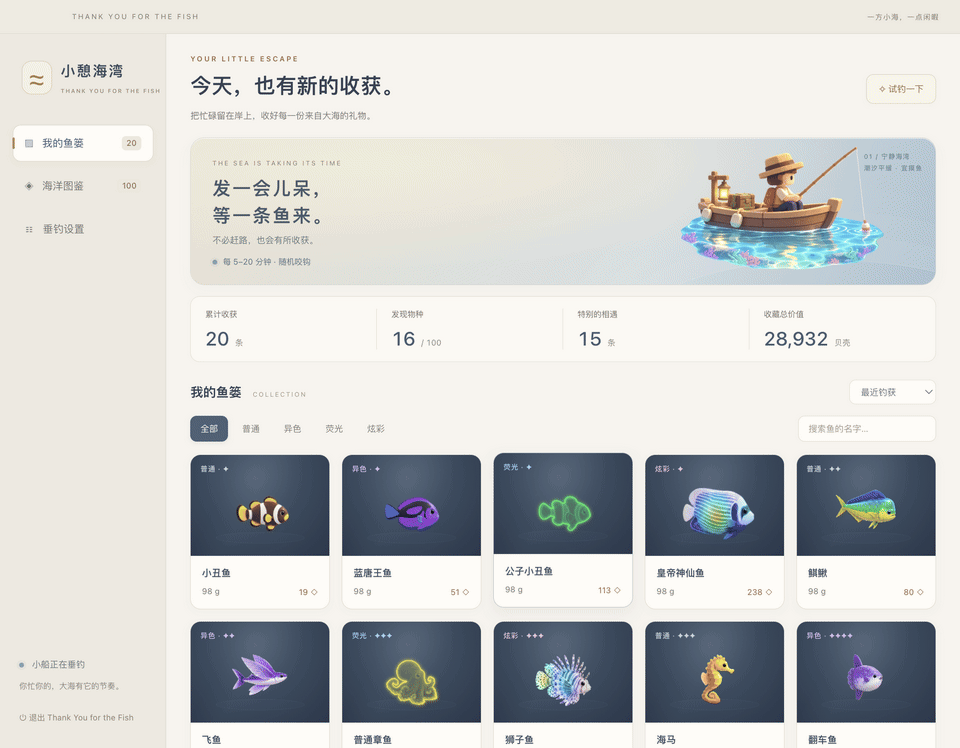
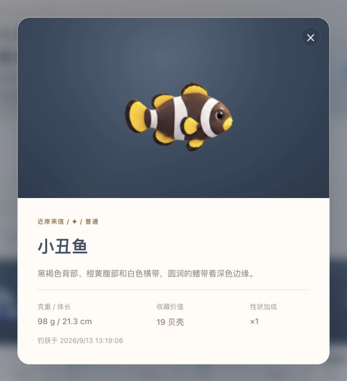

# Thank You for the Fish 🐟

**小憩海湾 · Thank You for the Fish｜把工位钓成水族馆**

**简体中文** · [English](README.md)

[](https://github.com/AmethystineAlpaca/thank-you-for-the-fish/releases/latest)
[](https://github.com/AmethystineAlpaca/thank-you-for-the-fish/actions/workflows/test.yml)
[](LICENSE)

**免费开源 · M 系列 Mac · 无需注册 · 安装后可离线玩**  
当前界面为简体中文，下载包尚未签名与公证；[下载与首次打开说明](#马上开钓)。

<video controls muted playsinline width="100%" poster="docs/images/desktop-showcase.png">
  <source src="docs/videos/desktop-showcase.mp4" type="video/mp4">
  您的浏览器不支持嵌入视频。[观看桌面录屏](docs/videos/desktop-showcase.mp4)。
</video>

*桌面效果图：小船就这样停在桌面一角，陪你等下一条鱼上钩。*

**上班没啥事儿，又不能立马走，怎么办？就摸鱼！**

而且这次，是真的有鱼。

该回的消息回完了，该交的东西交好了，离下班却还隔着一整个太平洋。你看一眼时间：怎么才过去三分钟？再看一眼桌面——诶，浮标动了。

鱼竿一弯，水花一闪，一条小鱼甩着尾巴跃出海面。

好了，今天的工作成果又多了一项：**钓获一条异色蓝唐王鱼。**

**小憩海湾是一款给 Mac 桌面放上一艘小船的放置钓鱼摸鱼软件。** 你处理你的事，小船等它的鱼；偶尔瞄一眼，收下大海偷偷塞给你的小惊喜。没有连招要练，没有任务催你，连盯着浮标都不是必修课。

[马上开钓](#马上开钓) · [看看有什么鱼](#100-种海洋生物把工位钓成水族馆) · [围观特异变种](#同一种鱼还能开出不同款) · [开发与验证](docs/DEVELOPMENT.md)



*本文动图录自实际应用，使用独立的演示收藏；桌面动图中的收竿为演示触发，正常垂钓默认每 5–20 分钟随机咬钩。*

## 人在工位，心在海湾

桌面角落，一艘小木船，晃晃悠悠。水面泛着光，倒影轻轻散开，钓鱼人安静地等，鱼线和浮标跟着水波摇。

你可以把小船拖到顺眼的位置，也可以捏住右下角的 **◢**，把它缩成桌边的小摆件，或者放大一点，看清这场迷你海钓。默认置顶、跨桌面显示，位置和大小都会记住。

船下的鱼讯条从暖红渐变到浅绿，小三角来回试探。它不报秒、不倒计时，只给你一种微妙的感觉：**有动静了……是不是快来了？**

然后，咬钩！浮标下沉，鱼竿提起，小鱼带着水花蹦出来，亮出名字和克重。鱼获会自动收好，没赶上围观也不用拍大腿。


**你等下班，它等上钩。大家都有光明的未来。**

## 100 种海洋生物，把工位钓成水族馆

**100 种海洋生物，5 组收藏图鉴，从浅海的可爱邻居，一路遇见深蓝里的神秘来客。** 有圆滚滚的小家伙，也有自带气场的大家伙，全都变成软乎乎的 3D 玩具模样，游进你的私人鱼篓。

最让人惦记的，永远是还没上钩的那一条。也许是图鉴里等了好久的新面孔，也许是老熟人换了一身稀有配色。端杯水回来，桌面就可能多一个值得开心的小理由。

没钓到的，先藏在剪影和问号后面；钓起来的，才亮出名字和模样。一个个灰暗的格子被点亮，一条条小鱼被收入囊中——**“再等一条就关”这句话，突然变得很难兑现。**

## 同一种鱼，还能开出不同款

钓到一条鱼只是开始。下一条同款，可能换了配色，可能自带荧光，也可能披着一身流动的彩虹。

**100 种生物 × 4 种性状，共 400 种物种与性状组合。** 再加上不同的体长和克重，同样叫“小丑鱼”，也可以各有各的身价。

- **普通款：** 原生配色，乖巧耐看。第一条上钩时，你会觉得：“嗯，小东西还挺可爱。”
- **异色款：** 同一条鱼，突然换了身新衣服。再看一眼，忍不住点开：“诶？这条怎么不一样！”
- **荧光款：** 周身泛着一圈柔光，像把海底的小夜灯钓了上来。收进鱼篓，连收藏都亮堂了。
- **炫彩款：** 彩虹覆上鱼鳞，光泽随着游动流转。好，今天的幸运时刻，就是现在。

**小鱼可以重样，惊喜不必重样。** 稀有物种碰上特殊性状，再长成一个大块头，这一竿就很值得截图留念。



*动图使用相同体型的演示鱼，依次展示普通、异色、荧光、炫彩。物种稀有度与性状共同决定每次相遇，具体概率见[开发说明](docs/DEVELOPMENT.md#收藏与抽取规则)。*

点开详情，它们还会轻轻摆尾、摇晃触手、舒展双翼。看着看着，你可能会忘记自己原本只是想查一下这条鱼值多少贝壳。

## 鱼可以慢慢钓，鱼篓一定要漂亮

每条收获都有名字、性状、克重、体长和收藏估值。鱼篓会替你记好累计鱼获、已发现物种、特殊鱼获和贝壳总值，攒着攒着，就有了自己的小小海洋收藏馆。

- **想看闪的？** 按异色、荧光、炫彩筛选，看看今天的运气。
- **想找某条？** 输入名字搜索，不用在鱼群里翻半天。
- **想比一比？** 按钓获时间、价值或克重排序，给大块头和稀罕货排排座次。
- **等不及了？** 点「试钓一下」看收获效果。试钓不计入正式收藏，也不会打乱正常垂钓计时。

贝壳只是收藏估值，没有商城、出售或交易。这里最贵重的东西，大概是忙里偷来的那一点闲暇。

## 马上开钓

### 直接下载：把小船带回桌面

1. 前往 [最新版本](https://github.com/AmethystineAlpaca/thank-you-for-the-fish/releases/latest)，下载 `thank-you-for-the-fish-macos-arm64.zip`。
2. 解压，把 **Thank You for the Fish.app** 拖进「应用程序」。
3. 双击打开，看到小船和菜单栏「Thank You for the Fish」，就已经开钓了。

当前发布包尚未经过 Developer ID 签名与公证。如果 macOS 阻止打开，请先确认文件来自本仓库的 Release，再按 [Apple 官方的打开说明](https://support.apple.com/zh-cn/guide/mac-help/mh40616/mac)操作。

### 已经在本地打包过：双击启动入口

当前打包版本适用于 **Apple Silicon（M 系列芯片）Mac**。

1. 打开项目文件夹，双击 **`双击启动小憩海湾.command`**。
2. 桌面出现小船，顶部菜单栏出现 **「Thank You for the Fish」**，就已经开始垂钓了。
3. 把小船拖到喜欢的位置。接下来，去忙，或者发会儿呆，等鱼自己来。

启动后弹出的终端窗口可以关闭。这个入口依赖项目里的 `dist` 文件夹，请把它们放在一起。

也可以直接双击应用，不经过终端：

```text
dist/Thank You for the Fish-darwin-arm64/Thank You for the Fish.app
```

可以把 `.app` 拖进「应用程序」文件夹，再加入 Dock，之后点图标就能开钓。如果下载的源码里没有 `dist`，按下面的方法运行。

### 只有源码：三步把海搬进桌面

准备好 **macOS、Node.js 22.12.0 或以上版本，以及 npm**。在终端进入项目文件夹后执行：

```sh
git clone https://github.com/AmethystineAlpaca/thank-you-for-the-fish.git
cd thank-you-for-the-fish
npm ci
npm start
```

首次安装需要联网下载依赖和 Electron；安装完成后，钓鱼、图鉴和收藏均可离线运行。以后从源码启动只需在项目目录执行 `npm start`。

如果安装后提示 Electron 未正确安装，补装 Electron 再启动：

```sh
node node_modules/electron/install.js
npm start
```

想生成可双击的 Apple Silicon Mac 应用：

```sh
npm run package
```

生成位置就是上面的 `dist/Thank You for the Fish-darwin-arm64/Thank You for the Fish.app`。修改代码后，需要重新打包，双击入口才会打开新版。Intel Mac 的打包命令见[开发说明](docs/DEVELOPMENT.md#打包)。

### 上船后，记住这几个按钮

| 想做什么 | 去哪里点 |
| --- | --- |
| 查看鱼获 | 小船下方「鱼篓」，或菜单栏「Thank You for the Fish」→「打开鱼篓」 |
| 查看图鉴 | 鱼篓左侧「海洋图鉴」 |
| 调整咬钩节奏 | 「垂钓设置」：默认 5–20 分钟，可在 1–120 分钟内设置随机间隔范围 |
| 暂停一会儿 | 小船下方暂停按钮，或设置里的「暂停垂钓」 |
| 缩放小船 | 拖动右下角 ◢，支持 60%–150%；双击手柄恢复默认大小 |
| 找不到小船 | 菜单栏「Thank You for the Fish」→「显示小船」 |
| 下班收船 | 菜单栏「Thank You for the Fish」→「退出 Thank You for the Fish」，或鱼篓左下角退出按钮 |

收藏自动保存在本机，退出不会清空。**退出后不累计离线鱼获，重新启动会重新计时；电脑休眠后恢复，最多补收一条。** 请勿同时运行开发版和打包版。更多日常启动说明见[启动说明.txt](启动说明.txt)。造型、稀有度、尺寸和贝壳估值均为游戏化表达。

## 帮小船漂到更多人的桌面

**今天第一条，钓到了什么？** 打开鱼获详情截张图，到 [Discussions 晒晒你的鱼](https://github.com/AmethystineAlpaca/thank-you-for-the-fish/discussions)。普通小鱼也算，留个名字、性状，再说说你把小船放在桌面的哪个角落。

想介绍给朋友或社区？[分享素材包](docs/SHARE.md#中文)里有中文封面、真实动图和可直接使用的简短介绍。

如果它让你的某个下午多了一点快乐，欢迎点个 **Star**，或者把它分享给也想在桌角养一片海的朋友。遇到问题、有新点子、想帮忙翻译界面，都可以 [开个 Issue](https://github.com/AmethystineAlpaca/thank-you-for-the-fish/issues) 或看看[贡献说明](CONTRIBUTING.md)。

项目采用 [MIT 许可](LICENSE)。美术由 AI 图片生成并整理为本地素材，动画与性状效果由代码实现；运行时不调用图片生成服务。

---

工作告一段落，给自己留一小片海。

**今天也辛苦了。剩下的，等鱼来。**
